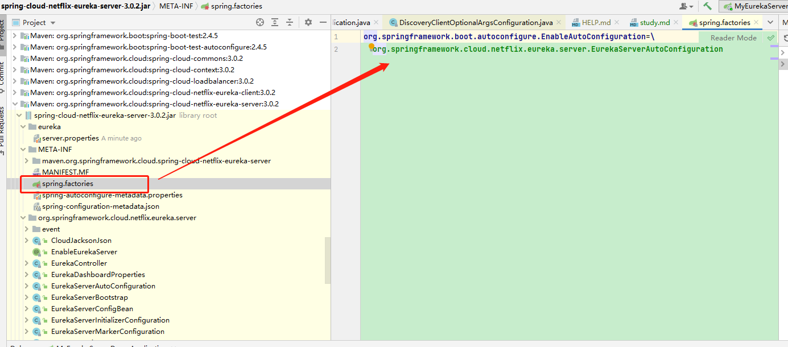

**记录查看eureka server 代码逻辑和启动过程**

⼊⼝：SpringCloud充分利⽤了SpringBoot的⾃动装配的特点
观察eureka-server的jar包，发现在META-INF下⾯有配置⽂件spring.factories

springboot应⽤启动时会加载EurekaServerAutoConfiguration⾃动配置类
EurekaServerAutoConfiguration类
⾸先观察类头分析

/**
* @author Gunnar Hillert
* @author Biju Kunjummen
* @author Fahim Farook
*/
  @Configuration
  @Import(EurekaServerInitializerConfiguration.class)  //3、导入inital这样的一个配置类
  @ConditionalOnBean(EurekaServerMarkerConfiguration.Marker.class)  //1、装配的前提 是容器中必须要用一个Marker的bean
  @EnableConfigurationProperties({ EurekaDashboardProperties.class,
  InstanceRegistryProperties.class })
  @PropertySource("classpath:/eureka/server.properties")
  public class EurekaServerAutoConfiguration extends WebMvcConfigurerAdapter {
//2、EurekaServerAutoConfiguration  重点关注

# 1.marker

需要一个marker bean，有了marker bean  才能装配  Euerka Server  ,那么这个marker的存在其实是由注解@EnableEurekaServer
决定的

@Target(ElementType.TYPE)
@Retention(RetentionPolicy.RUNTIME)
@Documented
//EurekaServerMarkerConfiguration 类 实例化了一个 Marker
@Import(EurekaServerMarkerConfiguration.class)
public @interface EnableEurekaServer {

}
也就是说只有添加了@EnableEurekaServer才有后面的动作，这成为了一个使用EurekaServer的前提

# 2.EurekaServerAutoConfiguration
**EurekaController**

注入对外的接口（后台管理页面）
可以在配置文件中使用eureka.dashboard.enable=false  关闭
@Bean
@ConditionalOnProperty(prefix = "eureka.dashboard", name = "enabled", matchIfMissing = true)
public EurekaController eurekaController() {
return new EurekaController(this.applicationInfoManager);
}

static {
    CodecWrappers.registerWrapper(JACKSON_JSON);
    EurekaJacksonCodec.setInstance(JACKSON_JSON.getCodec());
}

**PeerAwareInstanceRegistry**

对等节点感知注册器
集群模式下注册服务器使用到的注册器
EurekaServer 集群中各个节点是对等的，没有主从之分
@Bean
public PeerAwareInstanceRegistry peerAwareInstanceRegistry(ServerCodecs serverCodecs) {
this.eurekaClient.getApplications(); // force initialization
return new InstanceRegistry(this.eurekaServerConfig, this.eurekaClientConfig, serverCodecs, this.eurekaClient,
this.instanceRegistryProperties.getExpectedNumberOfClientsSendingRenews(),
this.instanceRegistryProperties.getDefaultOpenForTrafficCount());
}

**PeerEurekaNodes**

注入PeerEurekaNodes节点辅助封装对等节点的相关信息和操作，比如：更新集群中的对等节点
@Bean
@ConditionalOnMissingBean
public PeerEurekaNodes peerEurekaNodes(PeerAwareInstanceRegistry registry, ServerCodecs serverCodecs,
ReplicationClientAdditionalFilters replicationClientAdditionalFilters) {
return new RefreshablePeerEurekaNodes(registry, this.eurekaServerConfig, this.eurekaClientConfig, serverCodecs,
this.applicationInfoManager, replicationClientAdditionalFilters);
}

⽽在 com.netflix.eureka.cluster.PeerEurekaNodes#start⽅法中
newSingleThreadScheduledExecutor 构建了线程池
updatePeerEurekaNodes 更新对等节点信息(因为EurekaServer集群节点可能发生了变化)

**EurekaServerContext**

注入EurekaServer上下文 DefaultEurekaServerContext
@Bean
@ConditionalOnMissingBean
public EurekaServerContext eurekaServerContext(ServerCodecs serverCodecs, PeerAwareInstanceRegistry registry,
PeerEurekaNodes peerEurekaNodes) {
return new DefaultEurekaServerContext(this.eurekaServerConfig, serverCodecs, registry, peerEurekaNodes,
this.applicationInfoManager);
}

@Inject
public DefaultEurekaServerContext(EurekaServerConfig serverConfig,
    ServerCodecs serverCodecs,
    PeerAwareInstanceRegistry registry,
    PeerEurekaNodes peerEurekaNodes,
    ApplicationInfoManager applicationInfoManager) {
    this.serverConfig = serverConfig;
    this.serverCodecs = serverCodecs;
    this.registry = registry;
    this.peerEurekaNodes = peerEurekaNodes;
    this.applicationInfoManager = applicationInfoManager;
}
DefaultEurekaServerContext构建完毕后，会执行initialize()
然后会执行PeerEurekaNodes的start()方法

@PostConstruct
@Override
public void initialize() {
    logger.info("Initializing ...");
    peerEurekaNodes.start();
    try {
        registry.init(peerEurekaNodes);
    } catch (Exception e) {
        throw new RuntimeException(e);
    }
    logger.info("Initialized");
}

**EurekaServerBootstrap**

注入EurekaServerBootstrap，后续启动需要使用该对象
@Bean
public EurekaServerBootstrap eurekaServerBootstrap(PeerAwareInstanceRegistry registry,
EurekaServerContext serverContext) {
return new EurekaServerBootstrap(this.applicationInfoManager, this.eurekaClientConfig, this.eurekaServerConfig,
registry, serverContext);
}

**FilterRegistrationBean**

注册Jersey过滤器
Jersey是一个rest框架帮助我们发布restful服务接口(类似于SpringMVC)
@Bean
public FilterRegistrationBean<?> jerseyFilterRegistration(javax.ws.rs.core.Application eurekaJerseyApp) {
    FilterRegistrationBean<Filter> bean = new FilterRegistrationBean<Filter>();
    bean.setFilter(new ServletContainer(eurekaJerseyApp));
    bean.setOrder(Ordered.LOWEST_PRECEDENCE);
    bean.setUrlPatterns(Collections.singletonList(EurekaConstants.DEFAULT_PREFIX + "/*"));
    return bean;
}

# 3.EurekaServerInitializerConfiguration

**SmartLifeCycle**

实现该接口，可以在spring容器构建后，执行一些start方法

①eurekaServerBootstrap.contextInitialized初始化EurekaServerContext细节
②publish 发布事件
③EurekaServerInitializerConfiguration 状态设置
④publish 发布事件

@Override
public void start() {
new Thread(() -> {
    try {
        // TODO: is this class even needed now?
        eurekaServerBootstrap.contextInitialized(EurekaServerInitializerConfiguration.this.servletContext);
        log.info("Started Eureka Server");
        publish(new EurekaRegistryAvailableEvent(getEurekaServerConfig()));
        EurekaServerInitializerConfiguration.this.running = true;
        publish(new EurekaServerStartedEvent(getEurekaServerConfig()));
    }
    catch (Exception ex) {
        // Help!
        log.error("Could not initialize Eureka servlet context", ex);
    }
    }).start();
}

**EurekaServerBootstrap**

重点关注，进⼊
org.springframework.cloud.netflix.eureka.server.EurekaServerBootstrap#contextInitialized
initEurekaEnvironment(); 初始化环境信息
initEurekaServerContext();初始化context细节

org.springframework.cloud.netflix.eureka.server.EurekaServerBootstrap#initEurekaServerContext

protected void initEurekaServerContext() throws Exception {
    // For backward compatibility
    JsonXStream.getInstance().registerConverter(new V1AwareInstanceInfoConverter(),
    XStream.PRIORITY_VERY_HIGH);
    XmlXStream.getInstance().registerConverter(new V1AwareInstanceInfoConverter(),
    XStream.PRIORITY_VERY_HIGH);
    if (isAws(this.applicationInfoManager.getInfo())) {
        this.awsBinder = new AwsBinderDelegate(this.eurekaServerConfig,
                this.eurekaClientConfig, this.registry, this.applicationInfoManager);
        this.awsBinder.start();
    }
    //为非ioc容器提供获取serverContext对象接口		
    EurekaServerContextHolder.initialize(this.serverContext);
    log.info("Initialized server context");
    // Copy registry from neighboring eureka node
    //某一个server实例启动时，从集群中其他的server模块复制一份注册信息(同步)，
    //每个server对其他server来说都是客户端
    int registryCount = this.registry.syncUp();
    //更改实例状态为UP 并对外提供服务
    this.registry.openForTraffic(this.applicationInfoManager, registryCount);
    // Register all monitoring statistics
    //注册统计器.
    EurekaMonitors.registerAllStats();
}

**registry.syncUp()**

public int syncUp() {
    int count = 0;//计数
    //this.serverConfig.getRegistrySyncRetries() 可能上一次没有脸上远程的server 重试机制
    for(int i = 0; i < this.serverConfig.getRegistrySyncRetries() && count == 0; ++i) {
        if (i > 0) {
            try {
                Thread.sleep(this.serverConfig.getRegistrySyncRetryWaitMs());
            } catch (InterruptedException var10) {
                logger.warn("Interrupted during registry transfer..");
                break;
            }
        }
        //获取其他server的注册表信息
        Applications apps = this.eurekaClient.getApplications();
        Iterator var4 = apps.getRegisteredApplications().iterator();
        while(var4.hasNext()) {
            Application app = (Application)var4.next();
            Iterator var6 = app.getInstances().iterator();
            while(var6.hasNext()) {
                //把从远程获取到的注册信息，注册到自己的注册表中(map)
                InstanceInfo instance = (InstanceInfo)var6.next();
                try {
                    if (this.isRegisterable(instance)) {
                        this.register(instance, instance.getLeaseInfo().getDurationInSecs(), true);//是否复制
                        ++count;
                    }
                } catch (Throwable var9) {
                    logger.error("During DS init copy", var9);
                }
            }
        }
    }
    return count;
}

com.netflix.eureka.registry.AbstractInstanceRegistry#register（提供实例注册功能）
//注册实例到注册表中
public void register(InstanceInfo registrant, int leaseDuration, boolean isReplication) {
    try {
        this.read.lock();
        Map<String, Lease<InstanceInfo>> gMap = (Map)this.registry.get(registrant.getAppName());
        EurekaMonitors.REGISTER.increment(isReplication);
        if (gMap == null) {
            //判断有没有服务，如果没有的话就创建一个  new
            ConcurrentHashMap<String, Lease<InstanceInfo>> gNewMap = new ConcurrentHashMap();
            gMap = (Map)this.registry.putIfAbsent(registrant.getAppName(), gNewMap);
            if (gMap == null) {
                gMap = gNewMap;
            }
        }
        //判断服务中有没有该实例，如果没有的话 就创建 Lease 对象
        Lease<InstanceInfo> existingLease = (Lease)((Map)gMap).get(registrant.getId());
        if (existingLease != null && existingLease.getHolder() != null) {
        Long existingLastDirtyTimestamp = ((InstanceInfo)existingLease.getHolder()).getLastDirtyTimestamp();
        Long registrationLastDirtyTimestamp = registrant.getLastDirtyTimestamp();
        logger.debug("Existing lease found (existing={}, provided={}", existingLastDirtyTimestamp, registrationLastDirtyTimestamp);
        if (existingLastDirtyTimestamp > registrationLastDirtyTimestamp) {
        logger.warn("There is an existing lease and the existing lease's dirty timestamp {} is greater than the one that is being registered {}", existingLastDirtyTimestamp, registrationLastDirtyTimestamp);
        logger.warn("Using the existing instanceInfo instead of the new instanceInfo as the registrant");
        registrant = (InstanceInfo)existingLease.getHolder();
}

继续研究com.netflix.eureka.registry.PeerAwareInstanceRegistryImpl#openForTraffic

public void openForTraffic(ApplicationInfoManager applicationInfoManager, int count) {
    this.expectedNumberOfClientsSendingRenews = count;
    this.updateRenewsPerMinThreshold();
    logger.info("Got {} instances from neighboring DS node", count);
    logger.info("Renew threshold is: {}", this.numberOfRenewsPerMinThreshold);
    this.startupTime = System.currentTimeMillis();
    if (count > 0) {
    this.peerInstancesTransferEmptyOnStartup = false;
    }
    Name selfName = applicationInfoManager.getInfo().getDataCenterInfo().getName();
    boolean isAws = Name.Amazon == selfName;
    if (isAws && this.serverConfig.shouldPrimeAwsReplicaConnections()) {
        logger.info("Priming AWS connections for all replicas..");
        this.primeAwsReplicas(applicationInfoManager);
    }
    logger.info("Changing status to UP");
    //更改实例状态为  UP
    applicationInfoManager.setInstanceStatus(InstanceStatus.UP);
    super.postInit();//开启定时任务，默认每个60s进行一次服务的实效剔除
}

进⼊postInit()⽅法查看

protected void postInit() {
    this.renewsLastMin.start(); //实效剔除的定时任务
    if (this.evictionTaskRef.get() != null) {
        ((AbstractInstanceRegistry.EvictionTask)this.evictionTaskRef.get()).cancel();
    }
    //任务逻辑
    this.evictionTaskRef.set(new AbstractInstanceRegistry.EvictionTask());
    this.evictionTimer.schedule((TimerTask)this.evictionTaskRef.get(), this.serverConfig.getEvictionIntervalTimerInMs(), this.serverConfig.getEvictionIntervalTimerInMs());
}

